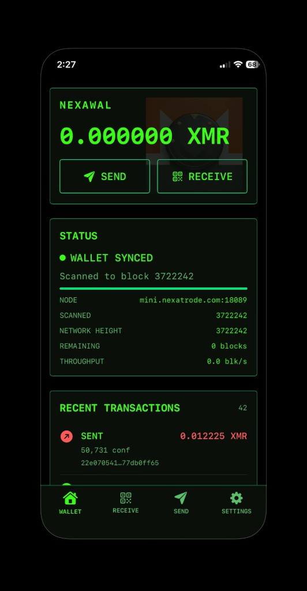
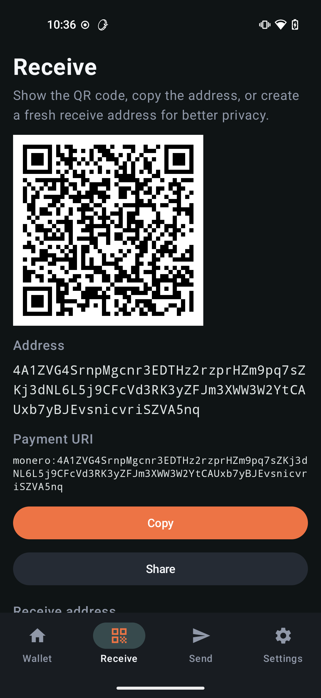
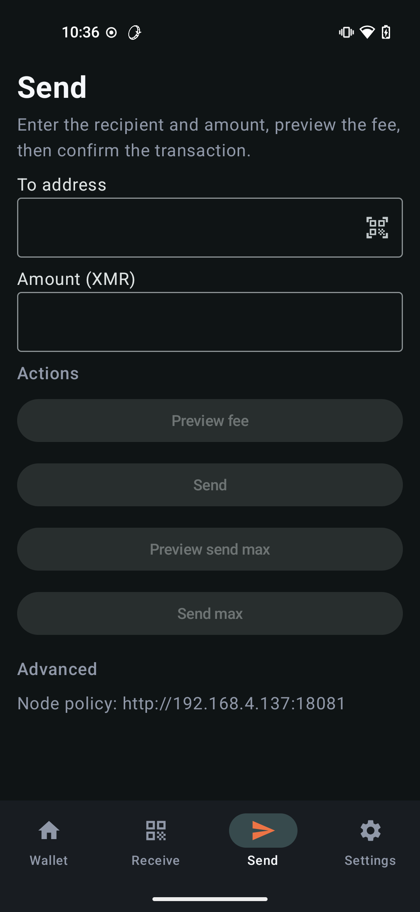
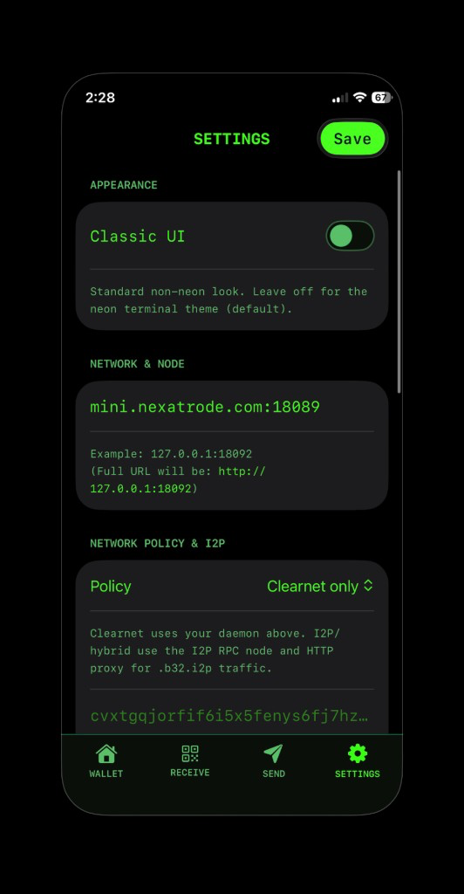

# nexawal

`nexawal` is an iOS Monero wallet built on top of `monero-oxide` and the `MoneroWalletCoreFFI` layer.

- iOS app: this repository
- Android app: [nexawal-android](https://github.com/cacaosteve/nexawal-android)
- Rust wallet core / Swift package: [MoneroWalletCoreFFI](https://github.com/cacaosteve/MoneroWalletCoreFFI) (`walletcore/aligned-2026-07-18`)
- Monero library work: [monero-oxide](https://github.com/cacaosteve/monero-oxide)

## Setup

```bash
git clone https://github.com/cacaosteve/nexawal.git
cd nexawal
open nexawal.xcodeproj
```

Xcode resolves `MoneroWalletCoreFFI` from GitHub on branch `walletcore/aligned-2026-07-18` (prebuilt xcframework — no Rust/NDK required). Use **File → Packages → Update to Latest Package Versions** to move to the tip of that branch.

## Screenshots

| Wallet | Receive |
| --- | --- |
|  |  |

| Send | Settings |
| --- | --- |
|  |  |

## Notes

- Single-wallet Monero app
- Uses a native wallet core built from `monero-oxide`
- Uses `MoneroWalletCoreFFI` to bridge the Rust core into Swift
- Syncs against standard Monero nodes, including local or remote nodes
